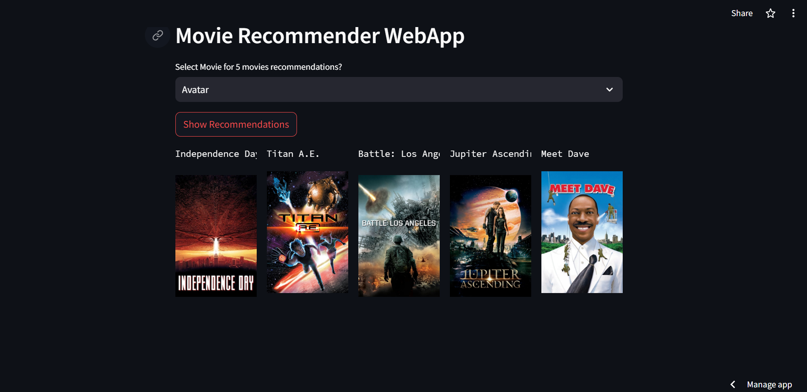

# Movies Recommender WebApp

## 🎬 Overview
This project is a movie recommender web application developed as a part of a data science project. The web app recommends 5 similar movies based on user input using machine learning.

## 🌟 Web App Screenshot


## 🛠️ Installation

1. **Clone the repository:**
   ```bash
   git clone https://github.com/ish-g/ML_P2_Movie-Recommender-System

2. **Navigate to the Project Directory:** 
    ```bash
   cd ML_P2_Movie-Recommender-System

3. **Install the required packages:**
    ```bash
   pip install -r requirements.txt

## 🚀 Usage

1. **Run the Flask application:**
    ```bash
   python streamlit_app.py

2. Open your web browser and navigate to `http://localhost:5000`

## 📚 Dataset
The dataset used for training the machine learning model is not included in this repository. You can use any movie dataset of your choice. Make sure the dataset contains features like movie title, genres, and plot summaries.

## 🤖 Machine Learning Model
The machine learning model used for recommendation is a content-based filtering model. It recommends movies similar to the ones provided by the user based on features such as genres, plot summaries, etc.

## 🌟 Technologies Used
- Python
- Streamlit (Python web framework)
- Scikit-learn (machine learning library)

## 🙌 Contributions
Contributions are welcome! If you have any ideas or suggestions to improve this project, feel free to open an issue or submit a pull request.

## 📜 License
This project is licensed under the [MIT License](LICENSE).